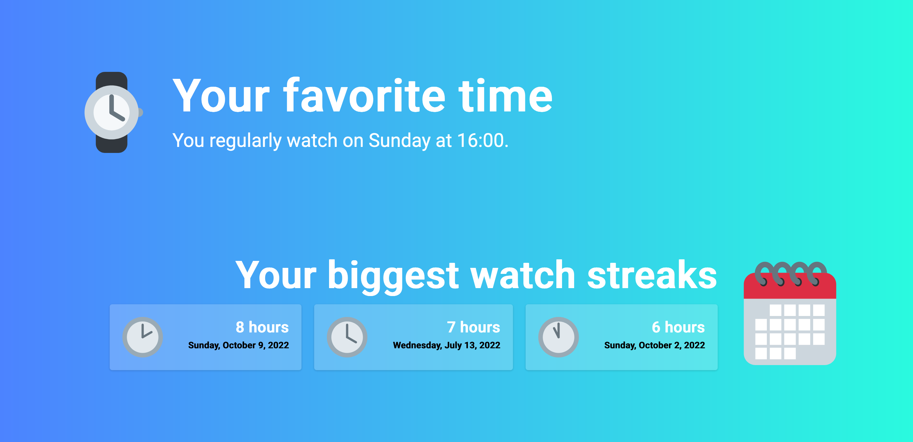

[](https://fresh.deno.dev)

# Emby Recap

A website displaying Emby user statistics in the form of a year recap.
Displaying watch times, durations, relative placements and counters.

# Installation

This project is released as a docker image available on DockerHub. It is also
possible to run the project directly when Docker is not desired. The docker
image provides the website on port 8000, which should be mapped to the
appropriate port on your host system.

## Docker Direct run

```bash
docker run -d -p 80:8000 -e "EMBY_URL=http://localhost:8096" -e "EMBY_API_KEY=ADMIN_ACCOUNT_TOKEN" hedium/emby-recap:latest
```

## Docker compose

```yaml
services:
  app:
    image: emby-recap:latest
    environment:
      EMBY_URL: "http://localhost:8096"
      EMBY_API_KEY: "ADMIN_ACCOUNT_TOKEN"
    ports:
        - "8000:80"
```

## Deno without docker

Provide the required environment variables in a `.env` file.

.env

```
EMBY_URL=http://localhost:8096
EMBY_API_KEY=ADMIN_ACCOUNT_TOKEN
```

```
deno run --allow-read --allow-env --allow-net main.ts
```

# Screenshots



